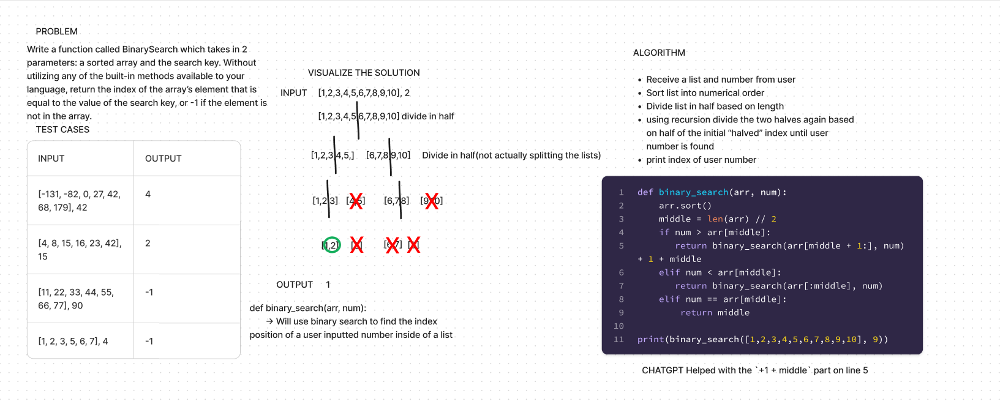
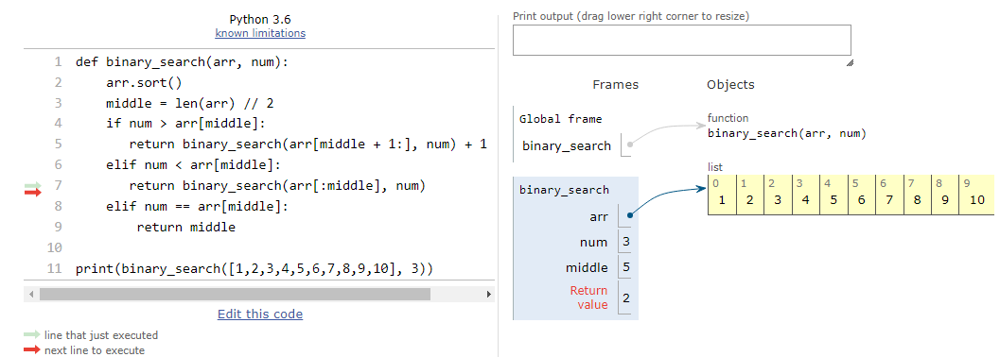
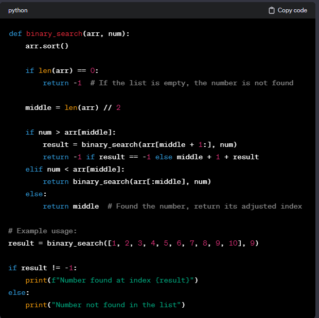

# Array Reverse
<!-- Description of the challenge -->

- In this challenge, I create a whiteboard that shows the process of creating a binary search function that takes in an array and number.  The code sorts the array and uses recursion to find the index number of the user inputted number.

## Whiteboard Process
<!-- Embedded whiteboard image -->

## Approach & Efficiency
<!-- What approach did you take? Why? What is the Big O space/time for this approach? -->

- My first step was to write down what I wanted to accomplish onto a flash card

- I documented test cases with their desired output

- Visualized the solution using a diagram that portrays the halving of the array

- Wrote an algorithm(not in code) that step by step shows what the code needs to accomplish

- I wrote my solution onto a flash card then inserted it into Figma's code widget

- Checked and adjusted my code based on suggestions from both pythontutor.com and chatgpt

- The Big O space/time would be exponential because of recursion

## Solution
<!-- Show how to run your code, and examples of it in action -->

- The solution put into pythontutor.com with the desired output:

- The final solution that CHATGPT suggested, used some tips but wanted to work on what I already had instead of changing to what it suggested:

