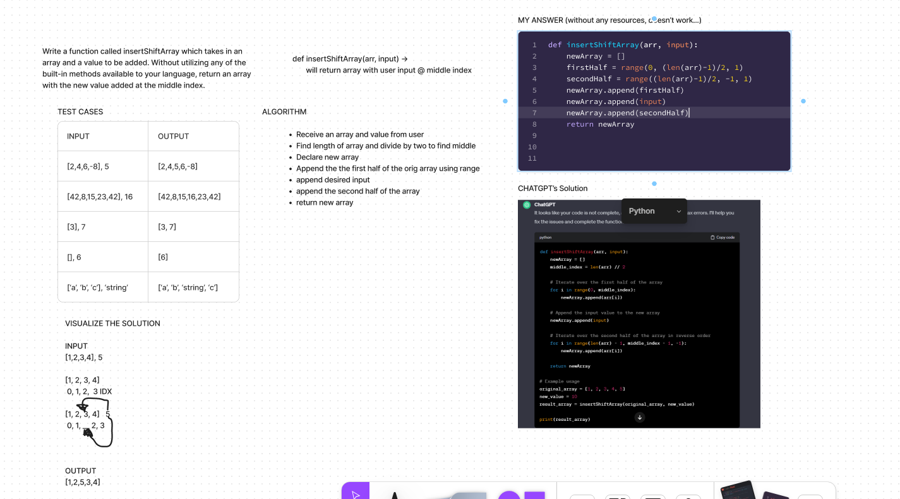
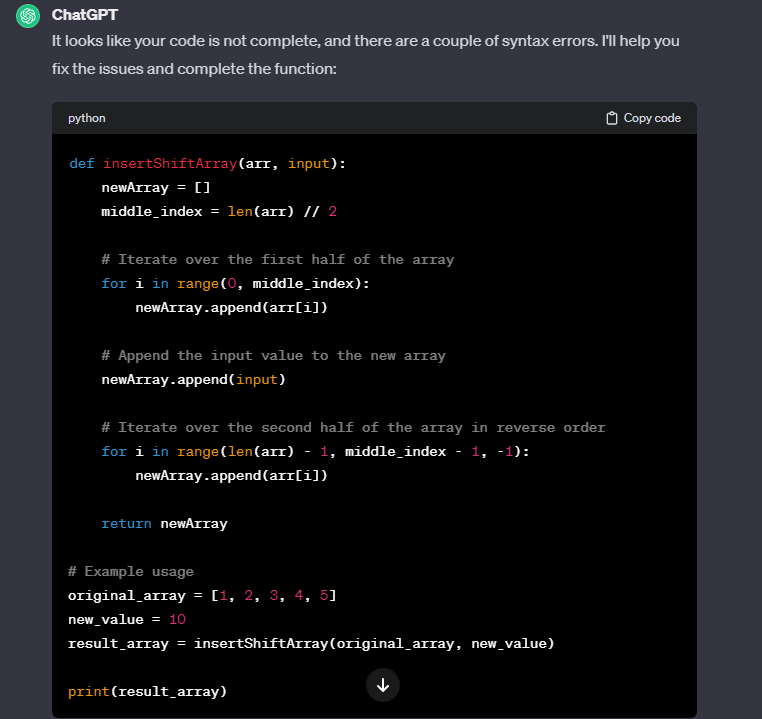

# Array Reverse
<!-- Description of the challenge -->

- In this challenge, I create a whiteboard that will input a user number into the middle of a list

## Whiteboard Process
<!-- Embedded whiteboard image -->

## Approach & Efficiency
<!-- What approach did you take? Why? What is the Big O space/time for this approach? -->

- My first step was to write down what I wanted to accomplish onto a flash card

- I then wrote out a function that would take an array and an input as a parameter.  The function would then declare a new empty array and divide the original array into two halves(first, second). I appended the first half into the new array, appended the user input, then appended the second half.  I learned that you still need to use a `for i in range...` to iterate through each index and add them to the new array.  From there I returned newArray.

- The function will end once all indices were appended into the new array.

- The Big O space/time would be Linear O(n)

## Solution
<!-- Show how to run your code, and examples of it in action -->

- I inputted what I had in the whiteboard into chatgpt then it provided these changes:

