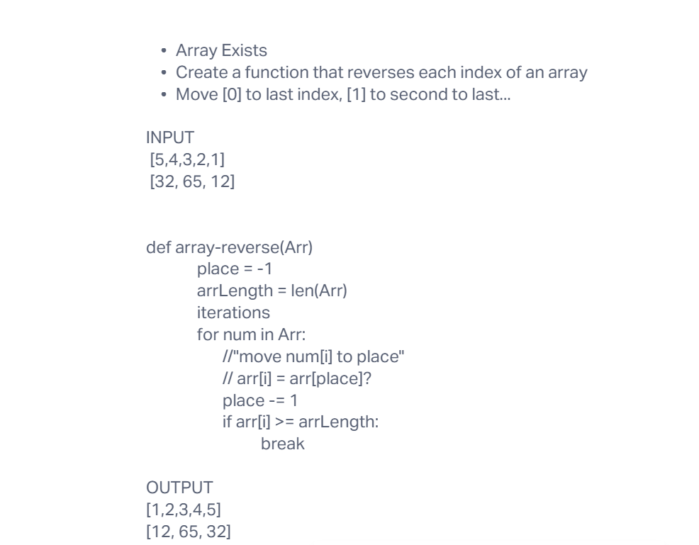
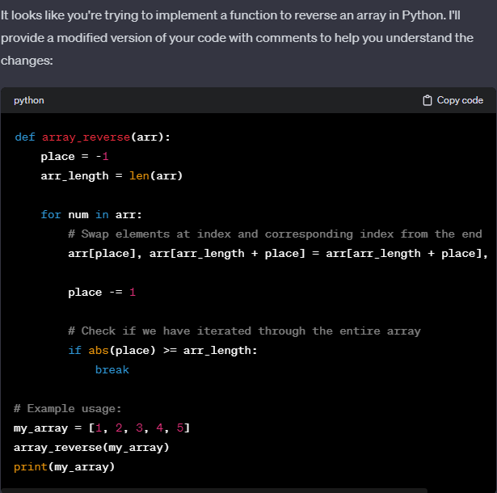

# Array Reverse
<!-- Description of the challenge -->

- In this challenge, I create a whiteboard that will reverse the items of an array depending on their index.

## Whiteboard Process
<!-- Embedded whiteboard image -->

## Approach & Efficiency
<!-- What approach did you take? Why? What is the Big O space/time for this approach? -->

- My first step was to write down what I wanted to accomplish onto a flash card

- I then wrote out a function that would take an array as a parameter, loop over it and assign the index of each value as the place variable(-1) which decrements with each iteration

- Once the loop iterates through the length of the array it will stop iterating.

- The Big O space/time would be Linear O(n)

## Solution
<!-- Show how to run your code, and examples of it in action -->

- I inputted what I had in the whiteboard into chatgpt then it provided these changes:

