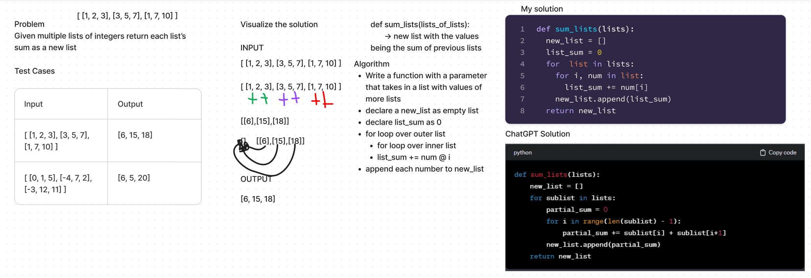
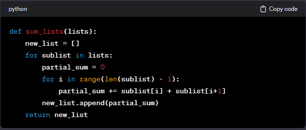

# Array Reverse
<!-- Description of the challenge -->

- In this challenge, I create a whiteboard that takes in a list made up of other lists and add the sums of each number into a new list

## Whiteboard Process
<!-- Embedded whiteboard image -->

## Approach & Efficiency
<!-- What approach did you take? Why? What is the Big O space/time for this approach? -->

- My first step was to write down what I wanted to accomplish onto a flash card

- I then wrote out a function that would take a as a parameter, declared an empty list and the variable list_sum = 0.  I looped over the parameter list and nested another for loop inside, I added list_sum += num[i] and then appended it to the empty list and returned it.

- The Big O space/time would be Linear O(n)

## Solution
<!-- Show how to run your code, and examples of it in action -->

- I inputted what I had in the whiteboard into chatgpt then it provided these changes:

