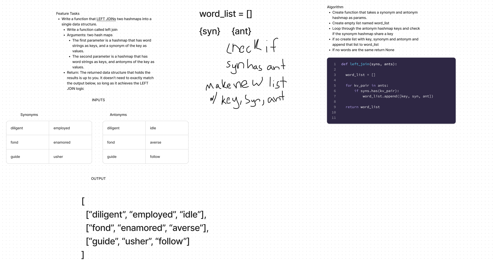

# Hashmap left join
<!-- Description of the challenge -->

- In this challenge, I create a function that joins synonyms and antonyms of a word based on if they share the same key in a hashmap

## Whiteboard Process
<!-- Embedded whiteboard image -->

## Approach & Efficiency
<!-- What approach did you take? Why? What is the Big O space/time for this approach? -->

- I first created the function with two params: syns, ants

- Initialized word_list which will be returned at the end

- Looped all the keys in syns using keys as index and appended a list with the key, syns value, and ants value

- Big(O) would be O(n)

## Solution
<!-- Show how to run your code, and examples of it in action -->

- [solution code](../../code_challenges/hashtable_left_join.py)
