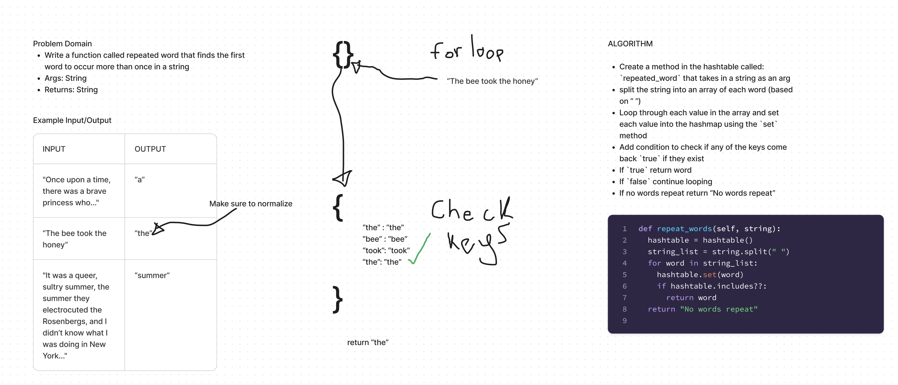

# Hashtable Repeated Word
<!-- Description of the challenge -->

- In this challenge, I create a function that returns first reoccuring word in a string.

## Whiteboard Process
<!-- Embedded whiteboard image -->

## Approach & Efficiency
<!-- What approach did you take? Why? What is the Big O space/time for this approach? -->

- I first created an instance of a hashtable locally

- I split the user inputted string based on regex, avoiding any spaces and punctuations

- I checked the hashtable to see if the key(word) already existed, if it did return the word

- Set the word into the hashtable

## Solution
<!-- Show how to run your code, and examples of it in action -->

- [code](../../code_challenges/hashtable_repeated_word.py)
