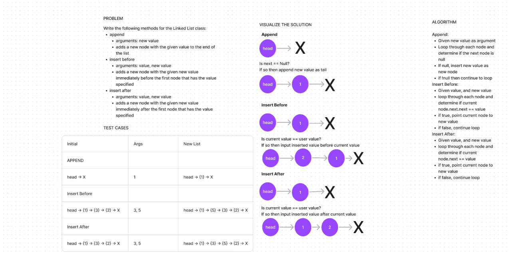
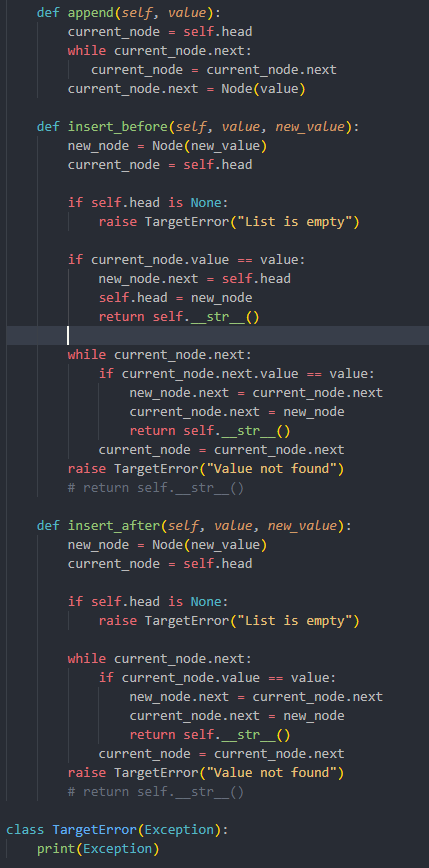

# Linked List
<!-- Description of the challenge -->

- In this challenge, I add  the append, insert before and insert after methods. 

## Whiteboard Process
<!-- Embedded whiteboard image -->

## Approach & Efficiency
<!-- What approach did you take? Why? What is the Big O space/time for this approach? -->

- Created whiteboard with problem, testcases, visualized solution and written out algorithmn

- From the whiteboard, I then started writing the code

- Started with append method, ensured test passed. Followed with the insert_before method, test passed and finally the insert after method.

- The Big O space/time would be Linear O(n)

## Solution
<!-- Show how to run your code, and examples of it in action -->

