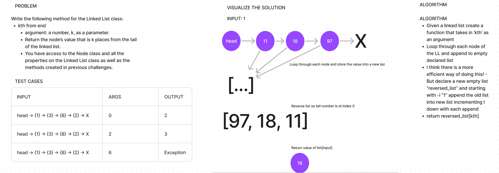

# Linked List kth from the end
<!-- Description of the challenge -->

- In this challenge, the method `kth_from_end` will return the value of a node "k" indexes from the tail

## Whiteboard Process
<!-- Embedded whiteboard image -->

## Approach & Efficiency
<!-- What approach did you take? Why? What is the Big O space/time for this approach? -->

- Created whiteboard with problem, testcases, visualized solution and written out algorithmn

- From the whiteboard, I then started writing the code

- Started by creating the function and ensured that it took the argument of k and was an instance method

- Looped through the nodes and stored each value into a list

- Set conditions dependant on if `k` was less than zero or larger than the list

- Reversed list and returned the value at `k`

- The Big O space/time would be Linear O(n)

## Solution
<!-- Show how to run your code, and examples of it in action -->

- All tests pass