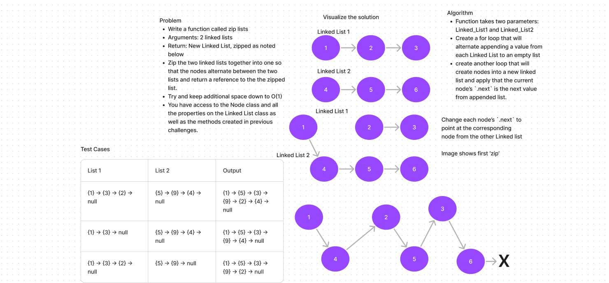

# Linked List
<!-- Description of the challenge -->

- In this challenge, I create a function that will 'zip' two linked lists together

## Whiteboard Process
<!-- Embedded whiteboard image -->

## Approach & Efficiency
<!-- What approach did you take? Why? What is the Big O space/time for this approach? -->

- Create the function that requires two LinkedLists as params.

- append each linked list to their own list

- loop through each linked list, alternating which value you append to a new "zipped_list" list.

- Create a new LinkedList with each node being a value from the zipped list

- The Big O space/time would be Linear O(n)

## Solution
<!-- Show how to run your code, and examples of it in action -->

- [Code](../../code_challenges/linked_list_zip.py)