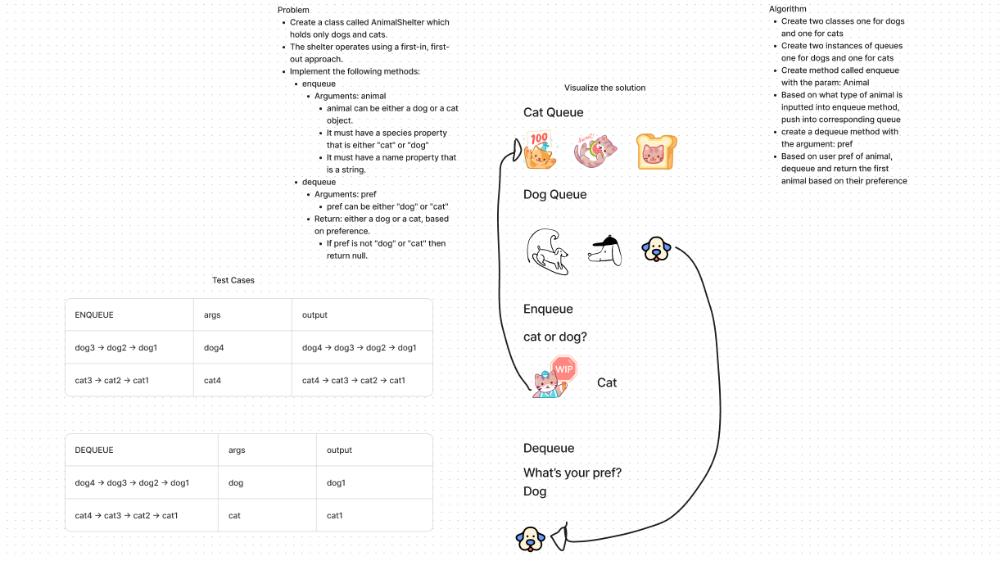

# Stack and Queue Animal Shelter
<!-- Description of the challenge -->

- In this challenge, I create an Animal Shelter class that queues/dequeues animals based on their species(cat/dog)

## Whiteboard Process
<!-- Embedded whiteboard image -->

## Approach & Efficiency
<!-- What approach did you take? Why? What is the Big O space/time for this approach? -->

- First instantiated the two queues, one for cats and one for dogs

- Then created the enqueue method, based on animal type it will enqueue the cat or dog in its respective queue

- Then created the dequeue method, based on user's preference of type of animal will dequeue from its respective queue and return the animal.

- The Big O space/time would be Linear O(n)

## Solution
<!-- Show how to run your code, and examples of it in action -->

- [Code](../../code_challenges/stack_queue_animal_shelter.py)