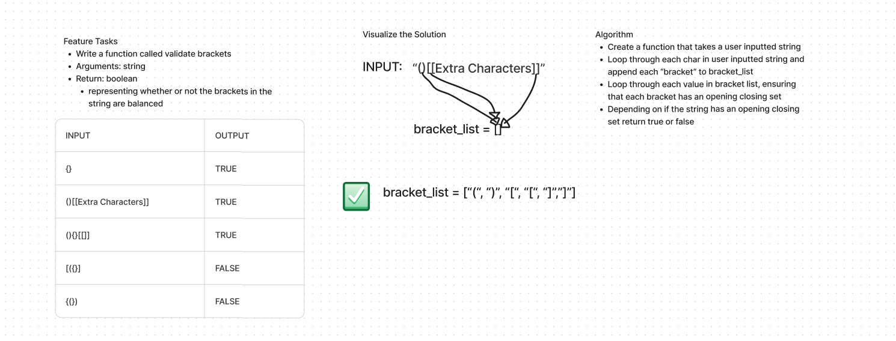

# Stack and Queue Animal Brackets
<!-- Description of the challenge -->

- In this challenge, I created a function that takes in a string and checks if the brackets (), {}, [] all have closing tags and are in a specific order

## Whiteboard Process
<!-- Embedded whiteboard image -->

## Approach & Efficiency
<!-- What approach did you take? Why? What is the Big O space/time for this approach? -->

- Created the function with an argument of a string

- Created an empty list

- Created the dictionary for the algorithm to compare to.

- Looped through the user's input and if a character in the string matched one of the dictionary's values, append it to the list.

- Add condition to also check if closing tag is apart of the bracket's list

- return true if string follows the rules, false if not.

- The Big O space/time would be Linear O(n)

## Solution
<!-- Show how to run your code, and examples of it in action -->

- [Code](../../code_challenges/stack_queue_brackets.py)