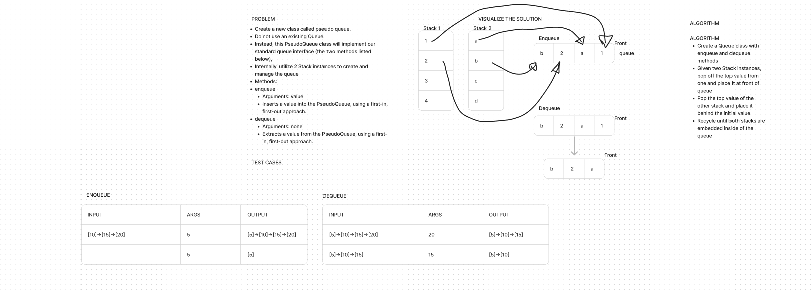

# Stack and Queue Pseudo
<!-- Description of the challenge -->

- In this challenge, I create a queue without creating a queue!  Using two stack instances.

## Whiteboard Process
<!-- Embedded whiteboard image -->

## Approach & Efficiency
<!-- What approach did you take? Why? What is the Big O space/time for this approach? -->

- Well my whiteboard is completely wrong.

- Kyle helped me understand what the challenge was asking for and walked me through.

- But the approach to take is to instantiate two stacks.

- The enqueue function solely pushes into stack one

- With the dequeue function, if stack one's top is true it'll pop and push into stack two

- Then stack two's top will pop and push the rest of the values back into stack one

## Solution
<!-- Show how to run your code, and examples of it in action -->

- [Pseudo Queue](../../code_challenges/stack_queue_pseudo.py)
