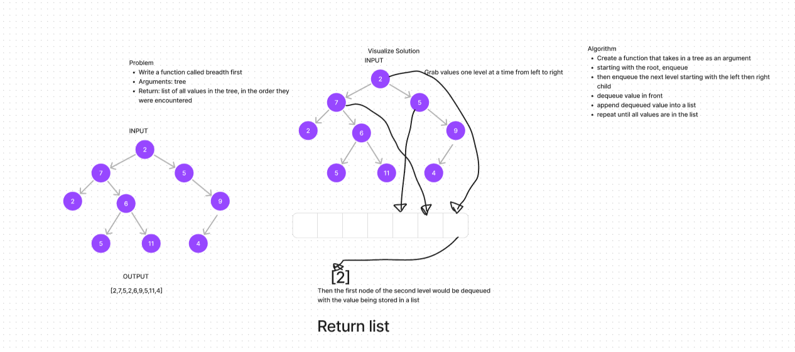

# Tree Breadth First
<!-- Description of the challenge -->

- In this challenge, I return a list of values from a tree using the breadth first method

## Whiteboard Process
<!-- Embedded whiteboard image -->

## Approach & Efficiency
<!-- What approach did you take? Why? What is the Big O space/time for this approach? -->

- At first I tried to solve the problem recursively, then ChatGPT suggested I do something else because recursive leads to depth first

- I then initialized a queue and created a while loop that while the queue is not empty append the dequeued value and enqueue the left and right nodes

## Solution
<!-- Show how to run your code, and examples of it in action -->

- [code](../../code_challenges/tree_breadth_first.py)