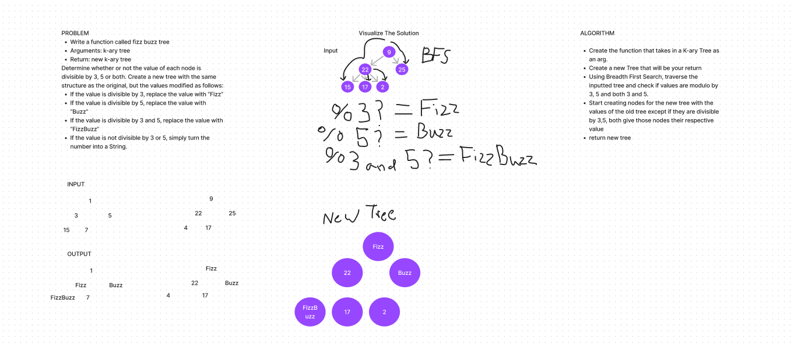

# Tree Fizz Buzz
<!-- Description of the challenge -->

- In this challenge,  

## Whiteboard Process
<!-- Embedded whiteboard image -->

## Approach & Efficiency
<!-- What approach did you take? Why? What is the Big O space/time for this approach? -->

- 

- The Big O space/time would be Linear O(n)

## Solution
<!-- Show how to run your code, and examples of it in action -->

- [solution code](../../code_challenges/tree_fizz_buzz.py)