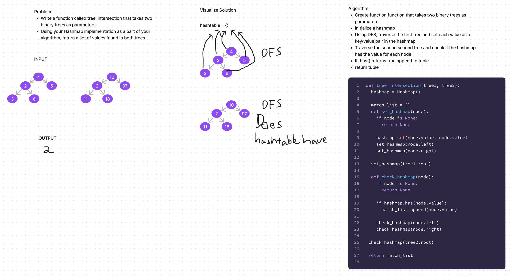

# Tree Intersection
<!-- Description of the challenge -->

- In this challenge, I create a function that takes in two binary trees and returns the values that are found in both trees

## Whiteboard Process
<!-- Embedded whiteboard image -->

## Approach & Efficiency
<!-- What approach did you take? Why? What is the Big O space/time for this approach? -->

- Followed along with the lecture and test requirements.

- The Big O space/time would be Linear O(n)

## Solution
<!-- Show how to run your code, and examples of it in action -->

